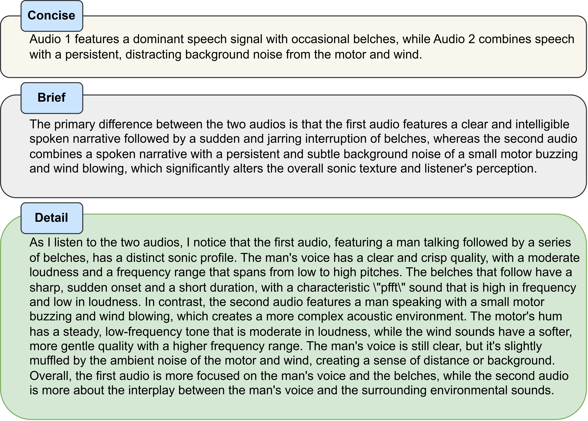

# ADIFF: Explaining audio difference using natural language
[[`Paper`](https://openreview.net/forum?id=l4fMj4Vnly)] [[`Checkpoint`](https://zenodo.org/records/14706090)]

This repository hosts the Audio Difference Explanation datasets and ADIFF checkpoint. ADIFF is an audio prefix tuning-based language model with a cross-projection module and undergoes a three-step training process. ADIFF takes two audios and text prompt as input and produces different tiers of difference explanations as output. This involves identifying and describing audio events, acoustic scenes, signal characteristics, and their emotional impact on listeners.


## Setup
1. Install the required dependencies: `pip install -r requirements.txt`. For [conda](https://www.anaconda.com), run the following: 

```shell
cd adiff && \
conda create -n adiff python=3.8 && \
conda activate adiff && \
pip install -r requirements.txt
```

2. Download ADIFF weights: [Pretrained Model \[Zenodo\]](https://zenodo.org/records/14706090)
3. Move the `adiff_base.pth` under `config` folder

## Usage
The wrapper class allows easy interaction with the model. To use the wrapper, inputs required are:
- `config`: The option supported is "base"
- `model_path`: Choose between adiff_base.ckpt or adiff_base_wavcaps.ckpt. The second checkpoint is trained on wavcaps difference along with ACD and CLD, can detect similarities between two audios, and has wider coverage of concepts. 
- `examples`: List of examples. Each example is a list containing three entries: audiopath1, audiopath2, prompt

Supported functions:
- `generate`: Produces text response for the given audio inputs and text prompt

### Generate difference explanation
```python
from wrapper import ADIFF

adiff = ADIFF(config="<choice of config>",model_path="<model weights")

examples = [
        ["<path1>", "<path2>", "explain the difference between the two audio in detail"],
        ["<path1>", "<path2>", "explain the difference between the two audio in one extended sentence"],
        ["<path1>", "<path2>", "explain the difference between the two audio in few words"],
    ]

response = adiff.generate(examples=examples, 
                            max_len=300, 
                            temperature=1.0
                            )
```

### Generate audio captions
```python
from wrapper import ADIFF

adiff = ADIFF(config="<choice of config>",model_path="<model weights")

examples = [
        ["<path1>", "<path2>", "caption the first audio"],
        ["<path1>", "<path2>", "caption the second audio"],
        ["<path1>", "<path2>", "caption both the audios"],
    ]

response = adiff.generate(examples=examples, 
                            max_len=300, 
                            temperature=1.0
                            )
```

### Dataset
The ACD and CLD dataset sources audio files from Clotho and AudioCaps dataset.  For the three tiers of difference annotation, the .csv are located under `data` folder

    .
    ├── ...
    ├── data              
    │   ├── ACD         # AudioCaps Difference Explanation
    |       ├── acd_test_adiff_fewwords_answer.csv
    |       ├── acd_test_adiff_sentence_answer.csv
    |       ├── acd_test_adiff_detail_answer.csv
    |       ├── ...
    │   ├── CLD         # Clotho Difference Explanation
    |       ├── cld_evaluation_adiff_fewwords_answer.csv
    |       ├── cld_evaluation_adiff_sentence_answer.csv
    |       ├── cld_evaluation_adiff_detail_answer.csv
    |       ├── ...
    └── ...
The audio files can be downloaded from their respective hosting website: [Clotho](https://zenodo.org/records/4783391) and [AudioCaps](https://github.com/cdjkim/audiocaps).

## Leaderboard
| Model   | Decoding | CLD-1 BLEU_4 | CLD-1 SPICE | CLD-2 BLEU_4 | CLD-2 SPICE | CLD-3 BLEU_4 | CLD-3 SPICE | ACD-1 BLEU_4 | ACD-1 SPICE | ACD-2 BLEU_4 | ACD-2 SPICE | ACD-3 BLEU_4 | ACD-3 SPICE |
|----------|------------|--------------|-------------|--------------|-------------|--------------|-------------|--------------|-------------|--------------|-------------|--------------|-------------|
| [ADIFF](https://openreview.net/forum?id=l4fMj4Vnly)    | Greedy       | 15.25        | 11.85       | 24.50        | 23.15       | 17.08        | 16.67       | 14.76        | 12.68       | 23.43        | 22.16       | 16.91        | 17.07       |

## Citation
```
@inproceedings{
    anonymous2025adiff,
    title={{ADIFF}: Explaining audio difference using natural language},
    author={Anonymous},
    booktitle={The Thirteenth International Conference on Learning Representations},
    year={2025},
    url={https://openreview.net/forum?id=l4fMj4Vnly}
}
```
